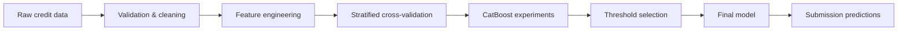

<div align="center">

# Credit Default Prediction

**A reproducible credit-risk classification pipeline that finished 1st on the course leaderboard.**


</div>

## Overview

This project predicts whether a credit-card customer will default, with an emphasis on **class imbalance, robust feature engineering, reproducible experimentation, and threshold selection**.

The final configuration reached a **public Macro F1 of 0.721**, placing **1st in the course leaderboard**.

| Final setup | Value |
| --- | ---: |
| Model | CatBoost |
| Experiment | `prune02` |
| Seed | `123` |
| Decision threshold | `0.328` |
| Public Macro F1 | **0.721** |
| Predicted defaults | `1,258` |

## What the pipeline does



The feature-engineering layer converts repayment history, bills, payments, and credit limits into higher-level behavioural signals such as:

- delay severity, persistence, and recent-trend features;
- bill exposure and utilisation ratios;
- repayment-capacity and payment-coverage features;
- recent vs historical behaviour summaries;
- normalized categorical values and clipped unstable ratios.

The experimentation pipeline is driven by `config.yaml`, making model settings and feature flags easy to reproduce and compare.

## Repository layout

```text
.
├── main.py                 # End-to-end training and prediction pipeline
├── eda.py                  # Exploratory analysis
├── config.yaml             # Experiment and feature configuration
├── data/                   # Development/evaluation inputs
├── assets/                 # EDA summaries
├── report.pdf              # Project report
├── submission.csv          # Selected leaderboard submission
└── requirements.txt
```

## Run locally

```bash
pip install -r requirements.txt
python main.py
```

Expected input files:

```text
data/dev.csv
data/eval.csv
data/submission.csv
```

The selected run produces `submission.csv` at the repository root.

## Project artifacts

- [`report.pdf`](./report.pdf) — full project report
- [`assets/eda_summary_table.csv`](./assets/eda_summary_table.csv) — compact EDA summary
- [`assets/report_eda_summary.pdf`](./assets/report_eda_summary.pdf) — EDA report artifact

## Why this project is useful

The interesting part is not simply training a classifier. The project shows an end-to-end tabular ML workflow: translating domain behaviour into features, evaluating under imbalance, controlling experiments through configuration, and optimizing the operating threshold for the target metric.

---

<sub>Academic machine-learning project at Politecnico di Torino.</sub>
